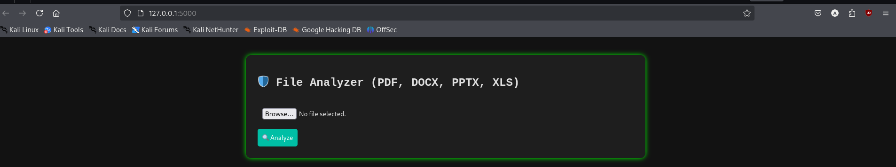
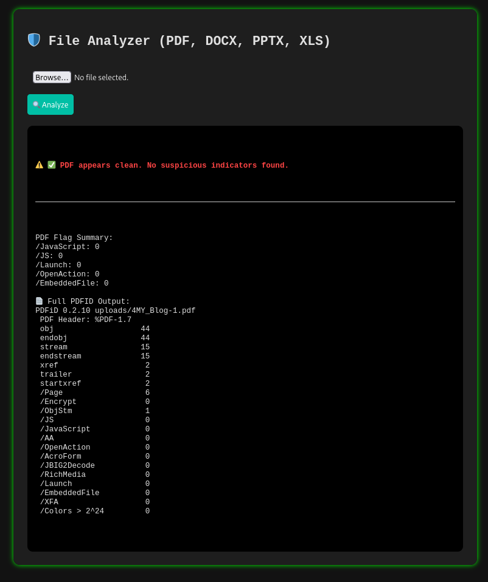

# 🛡️ DeepFileInspector

**DeepFileInspector** is a GUI-based malicious file analyzer that scans files like PDF, DOCX, PPTX, and more to detect embedded threats such as JavaScript, macros, OpenAction triggers, and suspicious payloads.

It’s designed for cybersecurity students, analysts, and developers who need to inspect potentially dangerous files in a simple and effective way.

---

## 🧠 Features

- 🔍 Detects threats in `.pdf`, `.docx`, `.pptx`, `.xls`, `.js`, `.ps1`, and more
- 🚨 Flags suspicious PDF features like `/Launch`, `/OpenAction`, `/EmbeddedFile`, etc.
- 🧬 Analyzes Office documents for VBA macros and hidden payloads
- 🖥️ Web-based GUI for easy drag-and-drop file uploads and instant result display
- 📊 Provides detailed breakdown with risk descriptions and threat summary

### 🖼️ GUI Interface



---

## ⚙️ Installation

1. **Clone the repository**
   ```bash
   git clone https://github.com/amitt-51/DeepFileInspector.git
   ```

2. **Navigate to the project directory**
   ```bash
   cd DeepFileInspector
   ```

3. **(Optional) Create a virtual environment**
   ```bash
   python3 -m venv venv
   source venv/bin/activate
   ```

4. **Install required dependencies**
   ```bash
   pip install -r requirements.txt
   ```

---

## 🚀 Usage

```bash
python app.py
```

Then open your browser and go to:  
👉 http://localhost:5000

---

## 🔍 PDF Threat Indicators Detected

- `/JavaScript`: Embeds JavaScript code inside the PDF
- `/Launch`: Tries to launch an external application like cmd.exe
- `/OpenAction`: Automatically runs code when the file is opened
- `/EmbeddedFile`: Hides another file within the document

Each of these indicators is explained with associated risks in the result panel.

---

## 📂 Supported File Types

| File Type | Analysis |
|-----------|----------|
| `.pdf`    | PDFiD-based threat indicator scanning |
| `.docx`, `.pptx`, `.xls` | Macro detection using `olevba` |
| `.js`, `.vbs`, `.ps1`, `.bat` | Suspicious keyword detection |
| Others    | Currently unsupported (safe fallback message shown) |

---

## 🛠️ Built With

- Python 3
- Flask
- `oletools`
- `pdfid` by Didier Stevens
- HTML, CSS (Dark theme)

---

## 🧾 License

MIT License – use, modify, or contribute freely.

---

## 🙋 Contact

- **Author**: [amitt-51](https://github.com/amitt-51)
- **Email**: hello@singhamit.in

---

## ⭐️ Show Some Love

If this project helped you or looks cool:  
👉 **Star the repo** | 🔁 **Fork** | 🐛 **Report Issues**
